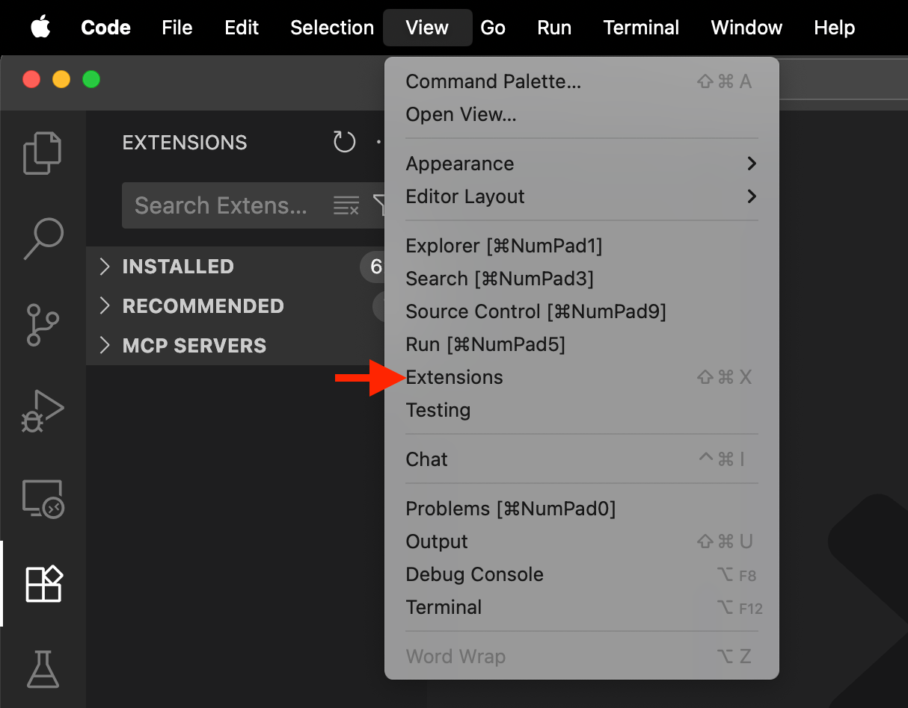
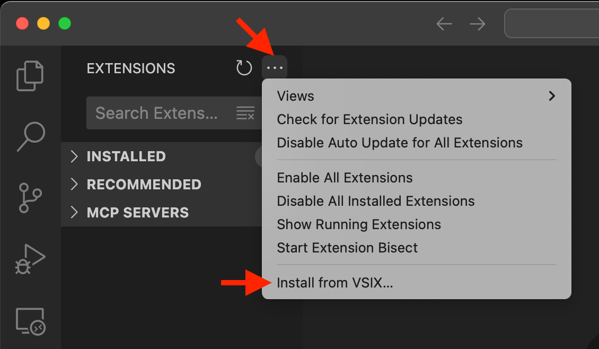
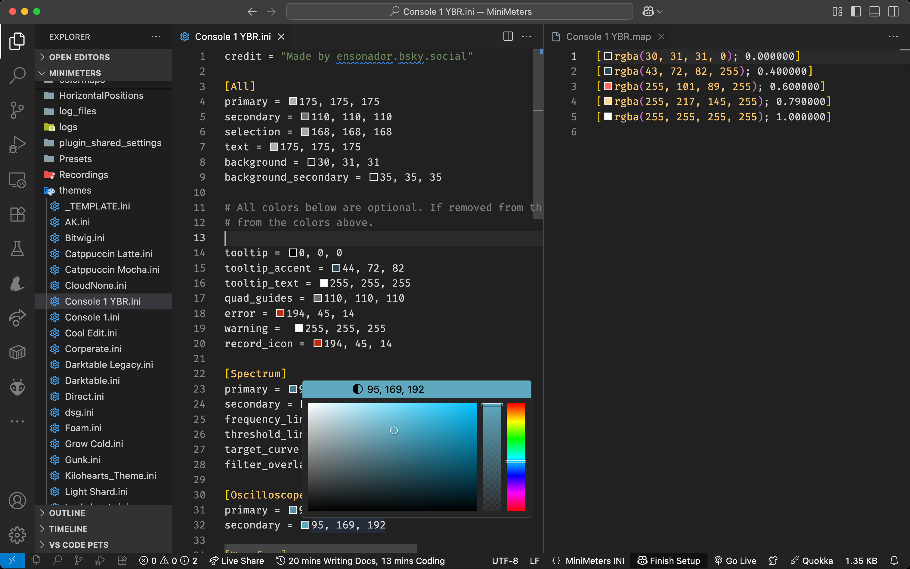

# minimeters-vscode-extension

> [Visual Studio Code](https://code.visualstudio.com/) extension for https://MiniMeters.app

## Installation

1. Download the VSXI file from [Releases](https://github.com/darosh/minimeters-vscode-extension/releases)
2. In main menu select `View > Extensions` 
3. In extension menu select `Install from VSIX...` 

## Configuration / Usage

1. Open the MiniMeters configuration folder in VS Code `/~/Library/Preferences/MiniMeters` (it is the one above the folder you can open from MiniMeters app in menu `Presets > Open Presets Folder...`)
2. Create `.vscode` folder and place in there the `settings.json` file from [Releases](https://github.com/darosh/minimeters-vscode-extension/releases)
3. Enjoy the color and syntax highlight in `*.map` and `*.ini` files 
